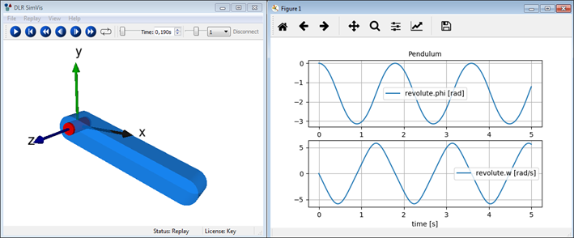
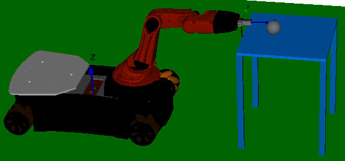

# Modia3D

[](https://travis-ci.org/ModiaSim/Modia3D.jl)
[](https://ci.appveyor.com/project/MartinOtter/modia3d-jl)
[](http://codecov.io/github/ModiaSim/Modia3D.jl?branch=master)
[](https://ModiaSim.github.io/Modia3D.jl/stable)
[](https://ModiaSim.github.io/Modia3D.jl/latest)
[](https://github.com/ModiaSim/Modia3D.jl/blob/master/LICENSE.md)


## Modia Platform

The *Modia platform* is a prototype system for the next modeling and simulation generation of physical systems described by differential and algebraic equations. It consists currently of the following Julia packages that are all under development (not all are yet publicly available):

- *[Modia](https://github.com/ModiaSim/Modia.jl)* - Equation based modeling
- *Modiator* - 2D/3D web-app model editor
- *[ModiaMath](https://github.com/ModiaSim/ModiaMath.jl)* - Simulation enviroment
- *[Modia3D](https://github.com/ModiaSim/Modia3D.jl)* - 3D geometry and 3D mechanics
- *[ModiaMedia](https://github.com/ModiaSim/ModiaMedia.jl)* - Thermodynamic property models
- *Modelia* - [Modelica model](https://www.modelica.org/modelicalanguage) importer


## Modia3D

Modia3D provides 3D geometry to physical systems so that geometrical objects can be
directly accessed and utilized in a model. Functions are provided, for example, to compute the volume,
mass, and inertia of a geometrical object or the distance between two objects.
Furthermore, Modia3D models 3D mechanical systems and shall be expanded into other domains in the future
(for example to utilize the 3D geometry to model heat flow in buildings or satellites).
In the future it will be possible, for example, to model the 3D mechanical part of a robot with Modia3D and the electrical motors and gearboxes that are driving the joints with Modia.

Modia3D uses ideas from modern computer game engines to achieve a highly flexible setup of mechanical systems including collision handling. Other features are utilized from multi-body programs, such as support for closed kinematic loops, and elastic response calculation. The underlying mathematical formulation are hybrid Differential Algebraic Equations (DAEs) that are solved with the variable-step solver IDA via the [Sundials.jl](https://github.com/JuliaDiffEq/Sundials.jl) Julia package.

Collision handling with elastic response calculation is performed for geometrical objects that are defined with a contact material and have a convex geometry or are approximated by the convex hull of a concave geometry.
Penetration depths and Euclidean distances are computed with the improved Minkowski Portal Refinement (MPR) algorithm [1].
The details of the contact law are provided in [5] and several examples are discussed in [4]. The user's view of Modia3D is introduced in [2] showing the very flexible definition of 3D systems. Some key algorithms are discussed in [3].
A more detailed overview of the available features is also given in the [Modia3D documentation](https://ModiaSim.github.io/Modia3D.jl/stable).

Papers and videos about Modia3D:

- [1] *[Collision Handling with Variable-Step Integrators](docs/resources/documentation/CollisionHandling_Neumayr_Otter_2017.pdf)* ([EOOLT 2017, December](http://www.eoolt.org/2017/))
- [2] *[Component-Based 3D Modeling of Dynamic Systems](http://www.ep.liu.se/ecp/154/019/ecp18154019.pdf)* ([American Modelica Conference 2018, October](https://www.modelica.org/events/modelica2018Americas/index_html))
- [3] *[Algorithms for Component-Based 3D Modeling](http://www.ep.liu.se/ecp/157/039/ecp19157039.pdf)* ([13th International Modelica Conference 2019, March](https://modelica.org/events/modelica2019))
- [4] *Modia3D: Modeling and Simulation of 3D-Systems in Julia* ([JuliaCon 2019, July](https://juliacon.org/2019/), under review); talk recorded on [YouTube](https://www.youtube.com/watch?v=b3WfqXZRKpA)
- [5] *Collision Handling with Elastic Response Calculation and Zero-Crossing Functions* (accepted for publication at ([EOOLT 2019, November](http://www.eoolt.org/2019/))

### 3D Renderer and Work-In-Progress Web App
Modia3D provides a generic interface to visualize simulation results with different 3D renderers. The [free community edition](https://visualization.ltx.de/) as well as the professional edition of the
[DLR Visualization library](http://www.systemcontrolinnovationlab.de/the-dlr-visualization-library/) are supported. Currently, another team is developing the free 2D/3D web-based authoring tool *Modiator* that includes result visualization, but it is not yet publicly available.


## Installation
**Modia3D** is registered in METADATA.jl and can be installed in the following way (Julia >= 1.0 is required):

```julia
julia> ]add Modia3D
        add ModiaMath  # in order to use simulate!(..) and plot(..)
        add PyPlot     # in order that plots are shown
```

Modia3D uses [PyPlot](https://github.com/JuliaPy/PyPlot.jl) for plotting. If `PyPlot` is not available in your current Julia environment an information message is printed and all `plot(..)` calls are ignored.

In order that plot windows are displayed, you need to add `PyPlot` to your current environment via `]add PyPlot`. Often this automatic installation fails and it is recommended to follow the instructions [Installing PyPlot in a robust way](https://github.com/ModiaSim/ModiaMath.jl/wiki/Installing-PyPlot-in-a-robust-way).

Modia3D visualizes the movement of 3D objects with a renderer. Currently, the (free) community or the (commercial) professional version of the [DLR Visualization](http://www.systemcontrolinnovationlab.de/the-dlr-visualization-library/) library are supported. To install the free version for *Windows* or for *Linux* perform the following steps:

1. Go to [https://visualization.ltx.de/](https://visualization.ltx.de/), provide your contact information and click on *Request download* for *Community Edition*. Afterwards, you get a link to download the library and you need to unzip the file.

2. In your Julia **startup file** (`HOME/.julia/config/startup.jl`) include the environment variable `ENV["DLR_VISUALIZATION"] = "<path-to-library>/Visualization/Extras/SimVis"`. Make sure that the SimVis executable under this directory has execution rights. For example in Linux with command:`chmod +x <path-to-library>/Visualization/Extras/SimVis`

3. Start Julia and run one of the examples, for example   `include("$(Modia3D.path)/examples/dynamics/Simulate_DoublePendulumWithDampers.jl")`

If Modia3D cannot use one of the renderers above, it will continue with renderer **NoRenderer** where result animation is switched off.


## Example

### Define a simple pendulum model

```julia
import ModiaMath  # Simulation environment
using  Modia3D

visuMaterial1 = Modia3D.Material(color="LightBlue", transparency=0.3);
visuMaterial2 = Modia3D.Material(color="Red");

@assembly Pendulum(;Lx = 1.0, Ly=0.2*Lx, Lz=0.2*Lx) begin
   world    = Object3D(Modia3D.CoordinateSystem(0.5*Lx))
   beam     = Object3D(Modia3D.Solid(Modia3D.SolidBeam(Lx,Ly,Lz), "Aluminium", visuMaterial1))
   bearing  = Object3D(beam; r=[-Lx/2, 0.0, 0.0])
   cylinder = Object3D(bearing,Modia3D.Cylinder(Ly/2,1.2*Ly; material=visuMaterial2))
   revolute = Modia3D.Revolute(world, bearing)
end;
simulationModel = Modia3D.SimulationModel(Pendulum(Lx=0.8),stopTime=5.0);
```

Two visualization materials (`visuMaterial1, visuMaterial2`) are defined, and optional parameters (`color, transparency`) are set. There are further optional parameters, but they are not used here.

The hierarchical structure of the pendulum is defined with the `@assembly` macro. A `SimulationModel` defines the top assembly and other properties needed for simulation (e.g. a default value for the `stopTime`).

Constructor `Object3D` generates a coordinate system in 3D with optional associated data, defining
for example a geometry and/or mass properties.
If the first argument of the constructor is another `Object3D`, then the generated `Object3D`
is defined relatively to the coordinate system of its first argument.
Function `Revolute` generates a revolute joint that constrains the movement of two `Object3Ds`.


### Simulate, animate and plot results

```julia
result = ModiaMath.simulate!(simulationModel);
ModiaMath.plot(result, ["revolute.phi", "revolute.w"]);
```



The model is simulated with the ModiaMath command `simulate!`, and the results are plotted (see right part of figure). A 3D animation is shown, if the DLR Visualization Library is enabled (see left part of figure).


## Run examples

Many examples are provided under `$(Modia3D.path)/examples`.
The following code shows how to execute some of these examples.

```julia
  import Modia3D
  include("$(Modia3D.path)/examples/dynamics/Simulate_Pendulum_explained.jl")
  include("$(Modia3D.path)/examples/dynamics/Simulate_DoublePendulumWithDampers.jl")
  include("$(Modia3D.path)/examples/collisions/Simulate_NewtonsCradle.jl")
  include("$(Modia3D.path)/examples/collisions/Simulate_YouBot.jl")
  include("$(Modia3D.path)/examples/kinematics/Move_FourBar.jl")
  include("$(Modia3D.path)/examples/visual/Move_AllVisualObjects.jl")
```
### Complex Model Simulation
At this package status more complex model simulations are possible, for example, a robot is kicking a ball off a table.
See `$(Modia3D.path)/examples/collisions/Simulate_YouBot.jl`:




## Run tests

```julia
  import Modia3D
  include("$(Modia3D.path)/test/runtests.jl")
```

Additionally to unit tests defined in `runtests.jl`, there are further test examples available
under `$(Modia3D.path)/test`.


## Status
The package has been tested with Julia on Windows 7, via the TravisCL on Linux (x86_64-pc-linux-gnu) and macOS (x86_64-apple-darwin14.5.0) and via the Appveyor CL on Windows.

Note, the collision handling is currently reasonably working for contacts between spheres as well as spheres and boxes. Still improvements are needed. Furthermore, kinematic loops are currently only supported for 2D loops and if they are driven kinematically. The technique to handle kinematic loops for dynamic simulations is demonstrated in the example `include("$(ModiaMath.path)/examples/withoutMacros_withoutVariables/Simulate_PendulumDAE.jl")` and is described in the paper *[Transformation of Differential Algebraic Array Equations to Index One Form](http://www.ep.liu.se/ecp/132/064/ecp17132565.pdf)*.

Up to now, Modia3D is implemented for functionality and not tuned for efficiency. Therefore, there are no benchmarks yet and in particular no comparison with Modelica models.

## Documentation
- [**STABLE**](https://ModiaSim.github.io/Modia3D.jl/stable) &mdash; *documentation of the last released version.*
- [**LATEST**](https://ModiaSim.github.io/Modia3D.jl/latest) &mdash; *in-development version of the documentation.*

## Issues and Contributions
Contributions are welcome, as are feature requests and suggestions.
Please open an [issue](https://github.com/Modia/Modia3D.jl/issues) in this case and also if you encounter problems.


## Main Developers and License
[Andrea Neumayr](mailto:andrea.neumayr@dlr.de) and [Martin Otter](https://rmc.dlr.de/sr/de/staff/martin.otter/)

[DLR - Institute of System Dynamics and Control](https://www.dlr.de/sr/en)

License: [MIT (expat)](LICENSE.md)
