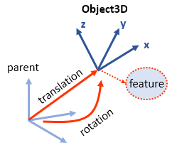

# Object3D

An [Object3D](@ref) constructor is the core element of Modia3D. It defines a coordinate system moving in 3D together with associated features like [Scene](@ref), [Visual](@ref) and [Solid](@ref):



```@meta
CurrentModule = Modia3D.Composition
```

```@docs
Object3D
```

A feature defines a property that is associated with an [Object3D](@ref).
Currently, the following `feature`s are supported:


## Scene

```@docs
Scene
```

```@meta
CurrentModule = Modia3D.Shapes
```

## Solid

```@docs
Solid
```

### Examples for Solids

How to compute or define mass properties?
```
# [M1]: mass properties are computed via shape geometry and predefined solidMaterial
# with defined density, this is the default setting
Solid(shape = Sphere(diameter=0.5), solidMaterial = "Steel")

# [M2]: mass properties are computed via shape geometry and a defined mass
Solid(shape = Sphere(diameter=0.5), massProperties = MassPropertiesFromShapeAndMass(mass=4.5))

# [M3]: mass properties are explicitly defined: with mass, center of mass, inertia matrix.
# For this option a shape and solidMaterial are optional.
Solid(massProperties = MassProperties(mass=2.0, centerOfMass=[1,2,3],
      Ixx=3.0, Iyy=4.0, Izz=4.0, Ixy=6.0, Ixz=7.0, Iyz=9.0) )
```

How to define [Solid](@ref)s for [Collision Handling](@ref)?
You always have to enable `collision` flag, and define a `shape` geometry. Make sure mass properties are computed and define how it behaves in contact situations.
```
# mass properties are computed like in [M1]
# it behaves like "Steel" in contact situations
Solid(shape = Sphere(diameter=0.5), solidMaterial = "Steel", collision = true)

# mass properties are computed like in [M1]
# it behaves like "DryWood" in contact situations
Solid(shape = Sphere(diameter=0.5), solidMaterial = "Steel", collision = true,
      contactMaterial = "DryWood")

# mass properties are computed like in [M2]
# it behaves like "Steel" in contact situations
Solid(shape = Sphere(diameter=0.5),
      massProperties = MassPropertiesFromShapeAndMass(mass=4.5),
      solidMaterial = "Steel", collision = true)

# mass properties are explicitly given like in [M3]
# it behaves like "Steel" in contact situations
Solid(shape = Sphere(diameter=0.5),
      massProperties = MassProperties(mass=2.0, centerOfMass=[1,2,3],
      Ixx=3.0, Iyy=4.0, Izz=4.0, Ixy=6.0, Ixz=7.0, Iyz=9.0),
      solidMaterial = "Steel", collision = true)
```

The following functions are provided for a [Solid](@ref) shape that is associated with an `Object3D`

| Function                     | Description |
|:-----------------------------|:------------|
| `volume(shape)`              | volume computation |
| `inertiaMatrix(shape, mass)` | returns inertia matrix of solid with respect to reference Object3D |
| `centroid(shape)`            | center of mass |
| `hasMass(object3D)`          | check if a shape has mass properties |
| `canCollide(object3D)`       | checks if `collision` flag is enabled |
| `boundingBox(shape, <other arguments>)` | bounding box - broad phase of [Collision Handling](@ref) |
| `supportPoint(shape, <other arguments>)`| needed for narrow phase of [Collision Handling](@ref) |
| further functions            | ... |

## Visual

```@docs
Visual
```
An Object3D is visible in visualization and animation export if a `shape` and a `visualMaterial` are defined.

### Examples for displaying Solid and Visual features
Visual features
```
# a visual shape is displayed with a user defined visual material
Visual(shape = Sphere(diameter=0.5), visualMaterial = VisualMaterial(color = "goldenrod1"))

# a visual shape is displayed with a default visual material
Visual(shape = Sphere(diameter=0.5))
```
Solid features
```
# a solid shape is displayed with a user defined visual material
Solid(shape = Sphere(diameter=0.5), visualMaterial = VisualMaterial(color = "aquamarine4"))

# a solid shape is displayed with a user defined visual material
Solid(shape = Sphere(diameter=0.5))

# this solid shape is NOT displayed
Solid(shape = Sphere(diameter=0.5), visualMaterial = nothing)
```
