# Shapes

```@meta
CurrentModule = Modia3D.Shapes
```


# ---- For Solid and Visual ----

## Sphere

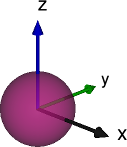

```@docs
Sphere
```


## Ellipsoid

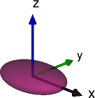

```@docs
Ellipsoid
```


## Box

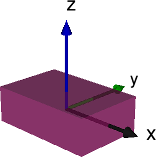

```@docs
Box
```

## Cylinder

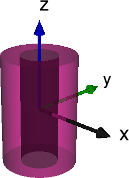

```@docs
Cylinder
```

## Cone

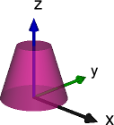

```@docs
Cone
```

## Capsule

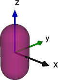

```@docs
Capsule
```

## Beam

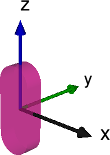

```@docs
Beam
```

## FileMesh

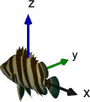

```@docs
FileMesh
```


# ---- Only for Visual ----


## CoordinateSystem

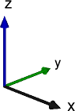

```@docs
CoordinateSystem
```

## Grid

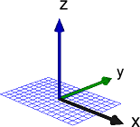

```@docs
Grid
```

## Spring

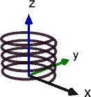

```@docs
Spring
```

## GearWheel

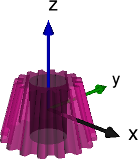

```@docs
GearWheel
```

## TextShape

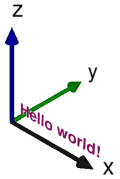

```@docs
TextShape
Font
```
