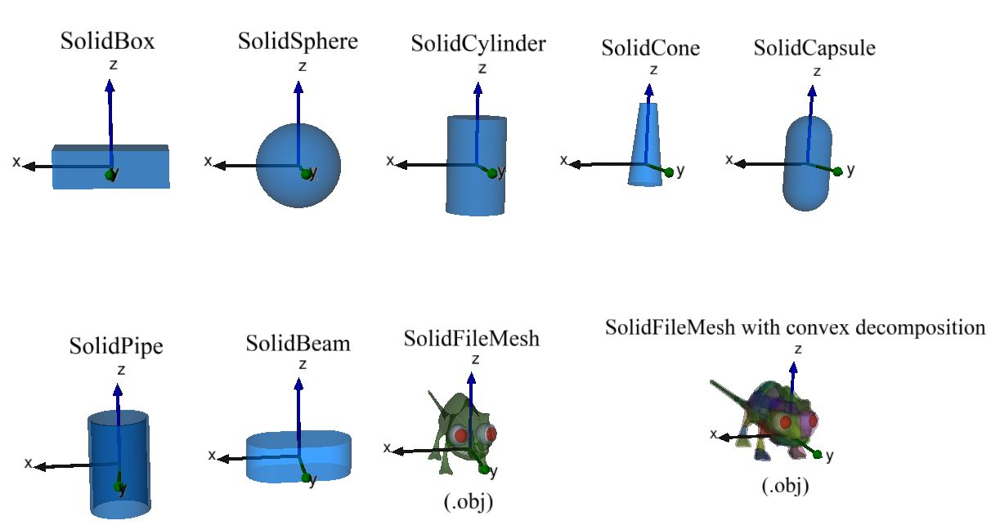
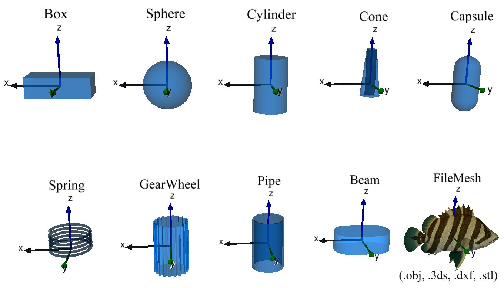
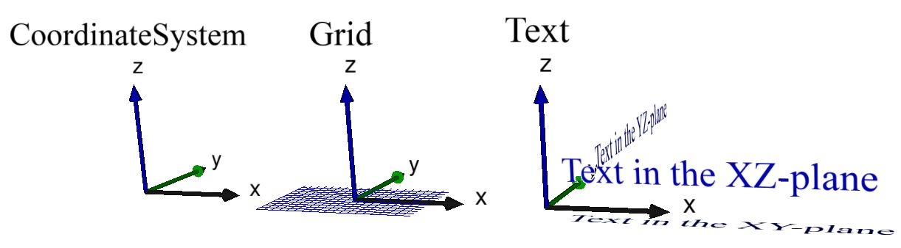
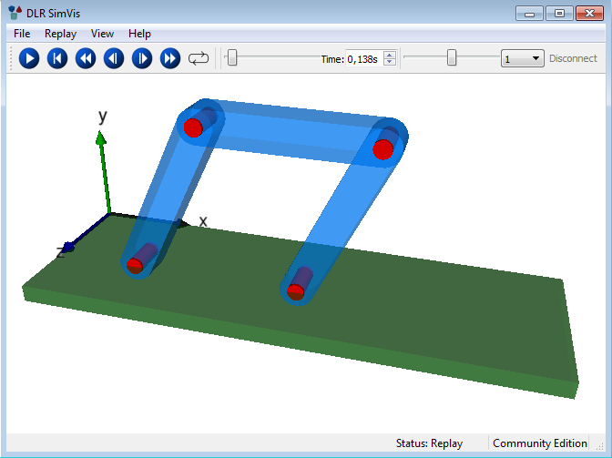

# Modia3D

[Modia3D](https://github.com/ModiaSim/Modia3D.jl) is a Julia package to model fixed and 
moving objects in 3D (*e.g.* visual shapes, rigid bodies).
These objects are driven kinematically by pre-defined time functions or are moving dynamically by 
solving Differential Algebraic Equations (DAEs)
with a variable-step DAE solver.

Collision handling with elastic response calculation is
performed for objects that are defined with a contact material and (a) have a convex geometry, or
(b) can be approximated by a set of convex geometries, or (c) have a concave geometry
that is (automatically) approximated by its convex hull. 
Papers about Modia3D:

- *[Collision Handling with Variable-Step Integrators](../resources/documentation/CollisionHandling_Neumayr_Otter_2017.pdf)* ([EOOLT 2017, December](http://www.eoolt.org/2017/))
- *Component-Based 3D Modeling Combined with Equation-Based Modeling*, accepted for publication at the
  [American Modelica Conference 2018, October 9-10](https://www.modelica.org/events/modelica2018Americas/index_html)

Before releasing version 1.0, Modia3D shall be
easily combinable with [Modia](https://github.com/Modia/Modia.jl), for example to define a controlled 
electrical motor with Modia, and add 3D behavior/visualization with Modia3D.
By this approach the best of both worlds can be combined:
Special 3D algorithms (Modia3D) + power/flexibility of equation based modeling (Modia).

## Package Features

A 3D object is an instance of struct [`Modia3D.Object3D`](@ref) and defines
a coordinate system moving in 3D together with associated data and properties.
The following Object3Ds are currently supported:

### Object3Ds with a solid part

Solid parts can be associated with a [`Modia3D.Object3D`](@ref). 
They are defined with struct [`Modia3D.Solid`](@ref) consisting of an **optional** solid geometry:

and other **optional** properties:

- mass propreties (defined by geometry+material-name, geometry+density, or directly defined mass properties),
- contact material (for elastic response calculation),
- visualization material (for visualization, see below).

Since the solid geometry itself is optional, it is possible to just define a
coordinate system with associated mass and inertia matrix.

The following functions are provided for a solid geometry `geo` that
is associated with an Object3D `object3D`:
- volume(geo),
- centroid(geo),
- inertiaMatrix(geo, mass),
- boundingBox(geo, <other arguments>),
- supportPoint(geo, <other arguments>),
- isVisible(object3D, renderer),
- hasMass(object3D),
- canCollide(object3D),
- and other functions.

### Object3Ds for visualization

Visualization elements that have **a visualization material**:

A visualiziation material has the following attributes:
- color (name or rgb-value),
- wireframe (false/true),
- transparency (0.0 is opaque, 1.0 is fully transparent),
- reflectslight (false/true),
- shininess (0.0 is matte surface, 1.0 is very shiny),
- shadowMask (defines whether or not an object casts or receives shadows)

Visualization elements that have **no** visualization material:

It is planned to support all other visualization elements
that are available in the **DLR Visualization library**
([see videos of this library](http://www.systemcontrolinnovationlab.de/the-dlr-visualization-library/)).

### Constraints on Object3Ds

An Object3D can be either **fixed** or **freely moving** with respect to another Object3D.
In the latter case, the movement is described by relative *quaternions*.

Furthermore, two Object3Ds can be connected together via various joint types. Currently,
**revolute** and **prismatic** joints are supported. In the near future, more joint types
will be added.

### Assemblies of Object3Ds

Object3D definitions can be collected together with the [`Modia3D.@assembly`](@ref) macro
in hierarchical structures. For example, in the following four bar mechanism
(consisting of 3 bars and the ground as 4th bar), a bar is defined as an assembly
consisting of a light-blue SolidBeam Object3D and two red Cylinder Object3Ds.
Such a bar is then in turn assembled in the assembly FourBar shown below:

There are the following operations on an instance of an assembly:

- [`Modia3D.visualizeAssembly!`](@ref)`(assembly)` to visualize the initial
  configuration of the assembly without simulating anything.
- [`Modia3D.SimulationModel`](@ref)`(assembly; analysis=xxx, <other arguments>)` to generate a
  `simulationModel` of the assembly that can be simulated with `ModiaMath.simulate!`. 
  The `analysis` keyword defines which analysis shall be carried out on the model.
  Currently supported are `KinematicAnalysis` to kinematically move the assembly, or
  `DynamicAnalysis` to solve the equations of motion of the assembly.
  In the future it is planned to support `QuasiStaticAnalysis` as well.

## Main developers

[Andrea Neumayr](mailto:andrea.neumayr@dlr.de) and 
[Martin Otter](https://rmc.dlr.de/sr/de/staff/martin.otter/)

[DLR - Institute of System Dynamics and Control](https://www.dlr.de/sr/en)

License: MIT (expat)