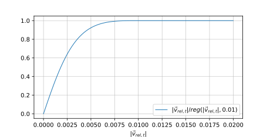

# Contact Force Law

Modia3D supports [Collision Handling](@ref) of objects that are defined with a contact material
and (a) have a convex geometry, or (b) can be approximated by a set of
convex geometries, or (c) have a concave geometry that is (automatically)
approximated by its convex hull. When contact occurs, the response
is computed with elastic (nonlinear) force/torque laws based on the
penetration depth and the relative motion of the objects in contact.
It is planned to optionally also support impulsive response calculation
in the future.

This section is based on [^4] with some improvements as used in the current
version of Modia3D.

The current approach has several **limitations** that a user must know,
in order that a simulation is successful:

- The current collision handling is designed for variable step-size integrators
  for systems that have realistic physical material behavior.

- Usually, a relative tolerance of ``10^{-8}`` or smaller has to be used since
  otherwise a variable step-size integrator will typically fail. The reason is that
  the penetration depth is computed from the difference of tolerance-controlled
  variables and the precision will be not sufficient if a higher tolerance will be
  used because the penetration depth of hard contact materials
  is in the order of ``10^{-5} .. 10^{-6}~ m``.
  A relative tolerancie of ``10^{-5}`` might be used, if the heuristic
  elastic contact reduction factor  is set to ``k_{red} = 10^{-4}`` (see [Material constants](@ref) below).

- A reasonable reliable simulation requires that objects have only
  *point contact*, since otherwise the contact point can easily ``jump`` between
  model evaluations and a variable step-size integrator will not be able to
  cope with this, so will terminate with an error.
  For this reason, all geometrical objects are slightly modified in various ways
  for the collision handling. Most important, all geometries are *smoothed* with a
  small sphere (e.g. with radius = 1mm) that is moved over all surfaces.
  Basically, this also means that if two objects are in contact, one of them should be a
  Sphere or an Ellipsoid.


## Material constants

The response calculation uses the following material constants from the
[Solid material](@ref) palette and from the
[Contact pair material](@ref) palette.

- `YoungsModulus` or `E` in [N/m^2]: Young's modulus of contact material (``\gt 0``).
- `PoissonsRatio` or `nu`: Poisson's ratio of contact material (``0 \lt nu \lt 1``).
- `coefficientOfRestitution` or `cor`: Coefficient of restitution between two objects (``0 \le cor \le 1``).
- `slidingFrictionCoefficient` or `mu_k`: Kinetic/sliding friction force coefficient between two objects (``\ge 0``).
- `rotationalResistanceCoefficient` or `mu_r`: Rotational rolling resistance torque coefficient between two objects (``\ge 0``).

Additionally, the response calculation is changed at small relative velocities
and relative angular velocities. This region is defined by the following constants:

- `vsmall` in [m/s]: Used for regularization when computing the unit vector in direction of
                     the relative tangential velocity (see below).
- `wsmall` in [rad/s]: Used for regularization when computing the unit vector in direction of
                       the relative angular velocity (see below).

Finally, the heuristic factor ``k_{red}`` (default = 1.0) can be defined with keyword argument
`elasticContactReductionFactor` in the [Scene](@ref) constructor.
The goal is the following:
Applying the elastic response calculation on hard materials
such as steel, typically results in penetration depths in the order of
``10^{-5} .. 10^{-6} m``. A penetration depth is implicitly computed by the
difference of the absolute positions of the objects in contact and
these absolute positions are typically error-controlled variables of
the integrator. This in turn means that typically at least a relative
tolerance of ``10^{-8}`` needs to be used for the integration, in order that
the penetration depth is computed with 2 or 3 significant digits.
To improve simulation speed, factor ``k_{red}``
reduces the stiffness of the contact and therefore enlarges the
penetration depth. If ``k_{red}`` is for example set to ``10^{-4}``, the penetration
depth might be in the order of ``10^{-3} m`` and then a relative tolerance
of ``10^{-5}`` might be sufficient. In many cases, the essential response
characteristic is not changed (just the penetration depth is larger),
but simulation speed is significantly improved.


## Response calculation

Assume two shapes penetrate each other as shown in the following figure:


The intuition is that there is a contact area with a certain pressure distribution in normal and a stress distribution in tangential
direction and that the response characteristics provides an approximation of the resultant contact normal force ``\vec{f}_n``,
resultant tangential force ``\vec{f}_t``, and resultant contact torque ``\vec{\tau}.``
The MPR algorithm calculates an approximation of the contact point, of the signed distance ``\delta``
and of a unit vector ``\vec{e}_n`` that is orthogonal to the contacting surfaces.
When penetration occurs, $\delta \ge 0$, and the contact response is computed from the elastic contact materials
of the two objects in the following way, for more details see [^4]
(the contact force law in normal direction is based on [^1], [^3],
the remaining force law on [^2] with some extensions and corrections):

```math
\begin{align}
f_n        &= k_{red} \max\left(0, c_{res} \cdot c_{geo} \cdot \delta^{n_{geo}} \cdot (1 + d \cdot \dot{\delta}) \right) \\
\vec{f}_n &= f_n \cdot \vec{e}_n \\
\vec{f}_t &= -\mu_{k} \cdot f_n \cdot \vec{e}_{t,reg} \\
\vec{\tau} &= -\mu_{r} \cdot \mu_{r,geo}  \cdot f_n \cdot \vec{e}_{\omega,reg}
\end{align}
```

where

- ``\vec{e}_n``: Unit vector perpendicular to the surface of object 1 at the contact point, pointing outwards.
- ``\vec{e}_{t,reg}``: Regularized unit vector in direction of the tangential relative velocity (see below).
- ``\vec{e}_{\omega,reg}``: Regularized unit vector in direction of the relative angular velocity (see below).
- ``f_n``: Value of normal contact force in direction of ``\vec{e}_n`` acting on object 2 (``f_n \ge 0``).
- ``\vec{f}_n``: Vector of normal contact force acting on object 2.
- ``\vec{f}_t``: Vector of sliding friction force acting on object 2 in opposite direction of the movement
                  in the tangential plane of the contact.
- ``\vec{\tau}``: Vector of rolling resistance torque acting on object 2, in opposite direction to the
                    relative angular velocity between the two contacting objects.
- ``\delta``: Signed distance between object 1 and 2 in normal direction ``\vec{e}_n``.
               ``\delta > 0`` if objects are penetrating each other.
- ``\dot{\delta}``: Signed relative velocity between object 1 and 2 in normal direction ``\vec{e}_n``.
- ``c_{res}``: Resultant elastic material constant in normal direction. This constant is computed
         from the constants ``c_1, c_2`` of the two contacting objects 1 and 2 as
         ``c_{res} = 1/\left( 1/c_1 + 1/c_2 \right)``. ``c_i`` is computed from the material properties as
         ``c_i = E_i/(1 - \nu_i^2)`` where ``E_i`` is Young's modules and
         ``\nu_i`` is Poisson's ratio of object i.
- ``c_{geo}``: Factor in ``f_n`` that is determined from the geometries of the
               two objects (see below).
- ``n_{geo}``: Exponent in ``f_n`` that is determined from the geometries of the
               two objects (see below).
- ``d(cor_{cur},\dot{\delta}^-)``: Damping coefficient in normal direction as a function of
         ``cor_{cur}`` and ``\dot{\delta}^-`` (see below).
- ``cor_{cur}``: Current coefficient of restitution between objects 1 and 2, see below.
- ``\dot{\delta}^-``: Value of ``\dot{\delta}`` when contact starts (``\dot{\delta}^- \ge 0``).
- ``\mu_k``: Kinetic/sliding friction force coefficient between objects 1 and 2.
- ``\mu_r``: Rotational rolling resistance torque coefficient between objects 1 and 2.
- ``\mu_{r,geo}``: Factor in ``\vec{\tau}`` that is determined from the geometries of the
                    two objects (see below).
- ``k_{red}``: Elastic contact reduction factor.

The ``\max(..)`` operator in equation (1) is conceptually provided, in order
to guarantee that ``f_n`` is always a compressive and never a pulling force because
this would be unphysical. In the actual implementation no ``max(..)`` function is used, because
an event is triggered when ``\delta`` drops below zero (so no penetration anymore) and after the
event no force/torque is applied anymore (meaning that ``f_n`` is only evaluated for about
``\delta > - 10^{-19} .. - 10^{-24} ~m`` (this depends on the contact situation and the contact materials)).

In special cases (for example sphere rolling on a plane), the rotational coefficient of friction ``\mu_{r,res}``
can be interpreted as *rolling resistance coefficient*.

Coefficients ``c_{geo}, n_{geo}, \mu_{r,geo}`` depend on the geometries of the objects
that are in contact. The coefficients are computed approximately based on the contact theory
of Hertz [^5], [^6]: Here, it is assumed that each of the contacting surfaces can be described by a
quadratic polynomial in two variables that is basically defined by its principal curvatures 
along two perpendicular directions at the point of contact. A characteristic feature is that 
the contact volume increases nonlinearly with the penetration depth, so ``n_{geo} > 1`` (provided
the two contacting surfaces are not completely flat), and therefore the normal contact force
changes nonlinearly with the penetration depth. In the general case, elliptical integrals
have to be solved, as well as a nonlinear algebraic equation system to compute the normal
contact force as function of the penetration depth and the principal curvatures at the contact point. 
An approximate *analytical* model is proposed in [^7]. 

In order that a numerical integration algorithm with step-size control
works reasonably, the contact force needs to be continuous and continuously differentiable with
respect to the penetration depth. This in turn means that the principal curvatures of the contacting
surfaces should also be continuous and continuously differentiable, which is usually not the case
(besides exceptional cases, such as a Sphere or an Ellipsoid).

Since the determination of the principal curvatures of shapes is in general
complicated and the shapes have often areas with discontinuous curvatures, only a very rough approximation
is used in Modia3D: *The contact area of a shape is approximated by a quadratic polynomial
with constant mean principal curvature in all directions and on all points on the shape*. 
In other words, a sphere with constant sphere radius ``r_{contact}`` is associated with every shape that
is used to compute coefficients ``c_{geo}, n_{geo}, \mu_{r,geo}``. A default value for ``r_{contact}``
is determined based on the available data of the shape (see [shape data](https://modiasim.github.io/Modia3D.jl/stable/Components/Shapes.html)):

xxx


## Regularized unit vectors

The unit vectors ``\vec{e}_t, \vec{e}_{\omega}`` are undefined if the relative velocity and/or
the relative angular velocity vanish. They are therefore approximately calculated using utility
function ``reg(v_{abs}, v_{small})``. This function returns ``v_{abs}`` if ``v_{abs} \ge v_{small}``
and otherwise returns a third order polynomial with a minimum of ``v_{small}/3`` at ``v_{abs}=0`` and
smooth first and second derivatives at ``v_{abs} = v_{small}``):

```math
reg(v_{abs}, v_{small}) = \text{if}~ v_{abs} \ge v_{small} ~\text{then}~ v_{abs} ~\text{else}~
                          \frac{v_{abs}^2}{v_{small}}
                          \left( 1 - \frac{v_{abs}}{3v_{small}} \right) + \frac{v_{small}}{3}
```

Example for ``v_{small} = 0.1``:


With ``\vec{v}_i`` the absolute velocity of the contact point of object ``i``,
and ``\vec{\omega}_i`` the absolute angular velocity of object ``i``,
the regularized unit vectors are calculated with function ``reg(...)``
in the following way:

```math
\begin{align}
\vec{e}_{t,reg}       =& \frac{\vec{v}_{rel,t}}{reg(|\vec{v}_{rel,t}|, v_{small})}; \quad
                          \vec{v}_{rel} = \vec{v}_2 - \vec{v}_1; \;
                          \vec{v}_{rel,t} = \vec{v}_{rel}  - (\vec{v}_{rel} \cdot \vec{e}_n) \vec{e}_n \\
\vec{e}_{\omega,reg} =& \frac{\vec{\omega}_{rel}}{reg(|\vec{\omega}_{rel}|,\omega_{small})}; \quad
                          \vec{\omega}_{rel} = \vec{\omega}_2 - \vec{\omega}_1
\end{align}
```

The effect is that the absolute value of a regularized unit vector
is approximated by the following smooth characteristics (and therefore the corresponding
friction force and contact torque have a similar characteristic)




## Damping coefficient

There are several proposal to compute the damping coefficient as a function
of the coefficient of restitution ``cor`` and the
velocity when contact starts ``\dot{\delta}^-``.
For a comparision of the different formulations see [^1], [^3].

Whenever the coefficient of restitution ``cor > 0``, then an object 2 jumping on an object 1 will
mathematically never come to rest, although this is unphysical. To fix this, the value of a
coefficient of restitution is set to zero at contact start when the normal velocity at this time instant
is smaller as ``v_{small}``:

```math
cor_{cur} = \text{if}~ |\dot{\delta}^-| > v_{small} ~\text{then}~ cor ~\text{else}~ 0
```

The damping coefficient ``d`` is basically computed with the formulation from [^1]
because a response calculation with impulses gives similar results for some experiments
as shown in [^3]. However, (a) instead of ``cor``, the current coefficient of restitution ``cor_{cur}``
is used and (b) the damping coefficient is limited to ``d_{max}`` (this parameter is set via `maximumContactDamping`
in object `Scene` and has a default value of ``2000 ~Ns/m``) to avoid an unphysical
strong creeping effect for collisions with small ``cor_{cur}`` values:

```math
d(cor_{cur},\dot{\delta}^-) = \min(d_{max}, \frac{8(1-cor_{cur})}{5 \cdot cor_{cur} \cdot \dot{\delta}^-})
```

Note, if ``cor_{cur} = 0``, then ``d = min(d_{max}, 8/0) = d_{max}``.


Examples of this characteristics are shown in the next figure:


In the next figure the simulation of a bouncing ball is shown where the response
calculation is performed (a) with an impulse and (b) with the compliant force law above.
In both cases the coefficient of restitution ``cor`` is zero
when ``|\dot{\delta}^-| < 0.01``. As can be seen, both formulations lead to
similar responses:


## Literature
[^1]: Paulo Flores, Margarida Machado, Miguel Silva, Jorge Martins (2011):
      [On the continuous contact force models for soft materials in
      multibody dynamics](https://hal.archives-ouvertes.fr/hal-01333699).
      Multibody System Dynamics, Springer Verlag,
      Vol. 25, pp. 357-375. 10.1007/s11044-010-9237-4.

[^2]: Martin Otter, Hilding Elmqvist, José Díaz López (2005):
      [Collision Handling for the Modelica MultiBody Library](https://modelica.org/events/Conference2005/online_proceedings/Session1/Session1a4.pdf).
      Proceedings of the 4th International Modelica Conference 2005,
      Gerhard Schmitz (Ed.), pages 45-53.

[^3]: Luka Skrinjar, Janko Slavic, Miha Boltezar (2018):
      [A review of continuous contact-force models in multibody dynamics](https://doi.org/10.1016/j.ijmecsci.2018.07.010).
      International Journal of Mechanical Sciences, Volume 145,
      Sept., pages 171-187.

[^4]: Andrea Neumayr, Martin Otter (2019):
      [Collision Handling with Elastic Response Calculation and Zero-Crossing Functions](https://doi.org/10.1145/3365984.3365986).
      Proceedings of the 9th International Workshop on Equation-Based Object-Oriented Modeling Languages and Tools. EOOLT’19. ACM, pp. 57–65.

[^5]: Hertz H. (1881):
      [Über die Berührung fester elastischer Körper](https://home.uni-leipzig.de/pwm/web/download/Hertz1881.pdf).
      Journal für die reine und angewandte Mathematik 92, S. 156-171.

[^6]: Johnson K.L. (1985):
      Contact Mechanics. Cambridge University Press.

[^7]: Antoine J-F., Visa C., and Sauvey C. (2006): 
      [Approximate Analytical Model for Hertzian Elliptical Contact Problems](https://citeseerx.ist.psu.edu/viewdoc/download?doi=10.1.1.1055.4455&rep=rep1&type=pdf).
      Transactions of the ASME, Vol. 128. pp. 660-664.