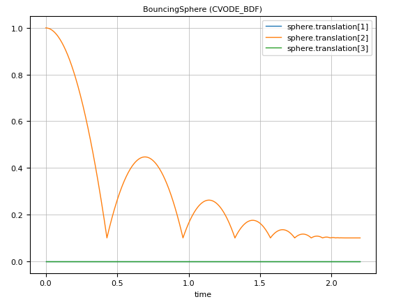

# Collision Handling

Collision handling with elastic response calculation is performed for convex shapes that are defined with a contact material or solid material. The elastic response calculation is currently solely based on the information about the largest penetration that is computed with an improved Minkowski Portal Refinement (MPR) algorithm. Collision response with an adaptive integration method works only reasonable, if the convex objects have point-contact.

Collision handling can be globally activated with keyword `enableContactDetection = true` set in the [Scene](@ref). Only [Solid](@ref) [Object3D](@ref)s can take place in collision situations.

The example in `"$(Modia3D.path)/test/Tutorial/BouncingSphere.jl"` defines a sphere that is bouncing on the ground. The essential statements are:

```
module BouncingSphere3D

using Modia3D

BouncingSphere = Model(
    boxHeigth = 0.1,
    world      = Object3D(feature=Scene(enableContactDetection = true,
                    animationFile = "BouncingSphere.json")),
    ground     = Object3D(parent=:world, translation=:[0.0,-boxHeigth/2,0.0],
                    feature=Solid(shape=Box(lengthX=4.0, lengthY=:boxHeigth, lengthZ=0.7),
                        visualMaterial=VisualMaterial(color="DarkGreen"),
                        solidMaterial="Steel",
                        collision=true)),
    sphere     = Object3D(feature=Solid(shape=Sphere(diameter=0.2),
                        visualMaterial=VisualMaterial(color="Blue"),
                        solidMaterial="Steel",
                        massProperties=MassPropertiesFromShapeAndMass(mass=0.001),
                        collision=true)),
    free       = FreeMotion(obj1=:world, obj2=:sphere, r=Var(init=[0.0, 1.0, 0.0]))
)

bouncingSphere = @instantiateModel(buildModia3D(BouncingSphere), unitless=true)
simulate!(bouncingSphere, stopTime=2.2, dtmax=0.1)

@usingModiaPlot
plot(bouncingSphere, "free.r", figure=1)

end
```
or
```julia
julia> import Modia3D
julia> include("$(Modia3D.path)/test/Tutorial/BouncingSphere.jl")
```

The commands above generate an instance of the model, simulate it and generate the following plot:



Note:

- Only [Solid](@ref) Object3Ds where a `shape` is defined and `collision=true` is considered in collision handling.

- Supported [Shapes](@ref) are: [Sphere](@ref), [Ellipsoid](@ref), [Box](@ref), [Cylinder](@ref), [Cone](@ref), [Capsule](@ref), [Beam](@ref), [FileMesh](@ref).
  - [FileMesh](@ref):
    - Only [.obj files](https://en.wikipedia.org/wiki/Wavefront_.obj_file) are supported.
    - MPR algorithm uses the convex hull of a concave geometry, or you have to partition it into convex sub meshes with e.g., [V-HACD](https://github.com/kmammou/v-hacd).

- Make sure mass properties are computed and define how it behaves in contact situations.
  Define a `solidMaterial="NameOfSolidMaterial"` or a `contactMaterial="NameOfContactMaterial"` (this defines for example YoungsModulus). The used names must be available in the `Modia3D/palettes/contactPairMaterials.json` where for various combinations of contact materials, additional data is provided (for example the `coefficientOfRestitution`). For more details about the contact material data, see [Solid material](@ref) and [Contact pair material](@ref). The details of the contact computation are sketched in [Contact Force Law](@ref).
