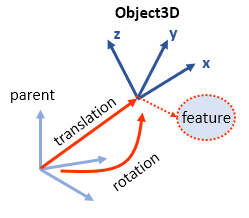
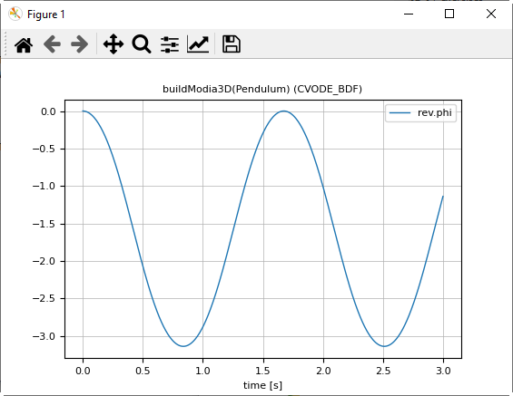
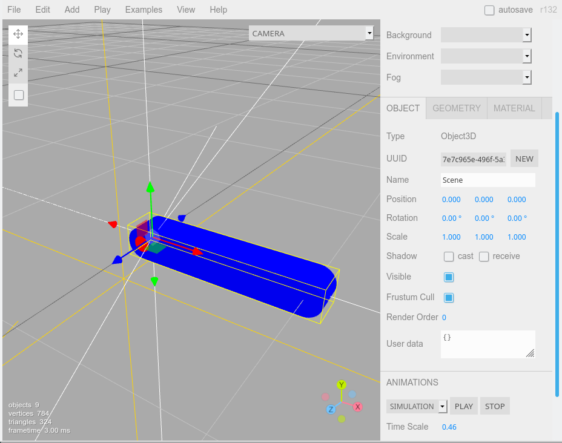
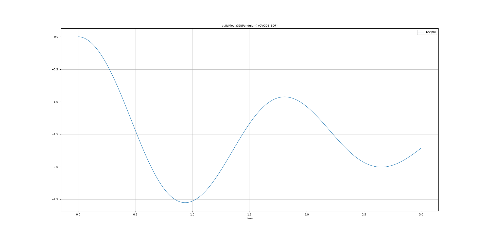

# Getting Started


An [Object3D](@ref) constructor is the core element of Modia3D. It defines a coordinate system moving in 3D together with associated features like [Scene](@ref), [Visual](@ref) and [Solid](@ref):




## 1. Pendulum

In the following example a simple pendulum is defined. This example is a copy of: `$(Modia3D.path)/test/Tutorial/Pendulum1.jl`. [Here](https://github.com/ModiaSim/Modia3D.jl/wiki/Full-Installation-Guide-for-Julia,-Modia3D,-Modia#running-julia-code-with-vs-codiumvs-code) is a short description of how to execute a Julia file in VS Code,

```julia
module Pendulum1

using Modia3D

Pendulum = Model3D(
    world     = Object3D(feature=Scene()),
    body      = Object3D(feature=Solid(massProperties=MassProperties(mass=1.0))),
    bodyFrame = Object3D(parent=:body, translation=[-0.5, 0.0, 0.0]),
    rev       = Revolute(obj1=:world, obj2=:bodyFrame)
)

pendulum = @instantiateModel(Pendulum, unitless=true)
simulate!(pendulum, stopTime=3.0)

@usingModiaPlot     # use the plot package defined by ENV["MODIA_PLOT"]
plot(pendulum, "rev.phi")

end
```
or execute it in the Julia `REPL`
```julia
julia> import Modia3D  # is only required for '$(Modia3D.path)' in the include command
julia> include("$(Modia3D.path)/test/Tutorial/Pendulum1.jl")
```

The `world` [Object3D](@ref) has feature [Scene](@ref) and is therefore the inertial system. The `body` Object3D is a [Solid](@ref) and defines the pendulum as a mass point with `mass = 1.0`. The `bodyFrame` Object3D defines a coordinate system on the `body` that is translated along the x-axis. A revolute joint connects `world` with `bodyFrame`.

With command `Model3D(..)`, a few lines of code are included, in order that joint variables are communicated between the Modia equations and the Modia3D multibody program. Keyword `unitless=true` defines that code generation is performed without units (because Modia3D does not yet fully support units in all components).

The commands above generate an instance of the model, simulate it and generate the following plot:




## 2. Pendulum with Animation

The Object3Ds of the first example are extended with [Visual](@ref) and [Solid](@ref) features in order that the pendulum parts are visualized and exported for offline animation by defining `animationFile = "Pendulum2.json"` in [Scene](@ref). The first Object3D `obj1` is defined as a solid [Beam](@ref) with `"Blue"`color and its [Solid material](@ref) is made of `"Steel"`. Mass, center of mass and inertia tensor are computed from Steel density and from the [Beam](@ref) shape. The second Object3D `obj2` is a visual red [Cylinder](@ref) that is used to visualize the axis of the revolute joint. Please, see example: `$(Modia3D.path)/test/Tutorial/Pendulum2.jl`

```julia
module Pendulum2

using Modia3D

Pendulum = Model3D(
    world = Object3D(feature=Scene(animationFile="Pendulum2.json")),
    obj1  = Object3D(feature=Solid(shape=Beam(axis=1, length=1.0, width=0.2, thickness=0.2),
                solidMaterial="Steel", visualMaterial=VisualMaterial(color="Blue"))),
    obj2  = Object3D(parent=:obj1, feature=Visual(shape=Cylinder(diameter=0.1, length=0.21),
                visualMaterial=VisualMaterial(color="Red")), translation=[-0.5, 0.0, 0.0]),
    rev   = Revolute(obj1=:world, obj2=:obj2)
)

pendulum = @instantiateModel(Pendulum, unitless=true)
simulate!(pendulum, stopTime=3.0)

@usingModiaPlot
plot(pendulum, "rev.phi")

end
```
or
```julia
julia> import Modia3D
julia> include("$(Modia3D.path)/test/Tutorial/Pendulum2.jl")
```

Open the [three.js editor](https://threejs.org/editor/), import (File --> Import) the [json file](https://github.com/mrdoob/three.js/wiki/JSON-Object-Scene-format-4) `Pendulum2.json` in your working directory and inspect the model:



View the simulation animation by clicking the Play button in the Object tab.

Export the animation in glb format (File --> Export GLB) to view it in a glb/[glTF](https://www.khronos.org/gltf/) viewer (for example the 3D-Viewer of Windows 10).


## 3. Pendulum with Modia equations

The pendulum model from the previous section is extended with a damper that is defined with Modia language components and models the damping (sliding friction) in the revolute joint. In order that this is possible, a `RevoluteWithFlange` joints has to be used that provides a `Flange` connector to which a rotational 1-dim. `Flange` of Modia can be connected. This flange and the Damper, and the Fixed component are defined in a small Modia model library that is included via`include("$(Modia.path)/models/AllModels.jl")`. Please, see example: `$(Modia3D.path)/test/Tutorial/Pendulum3.jl`

```julia
module Pendulum3

using Modia3D

include("$(Modia3D.modelsPath)/AllModels.jl")

Pendulum = Model3D(
    world = Object3D(feature=Scene(animationFile="Pendulum3.json")),
    obj1  = Object3D(feature=Solid(shape=Beam(axis=1, length=1.0, width=0.2, thickness=0.2),
                solidMaterial="Steel", visualMaterial=VisualMaterial(color="Blue"))),
    obj2  = Object3D(parent=:obj1, feature=Visual(shape=Cylinder(diameter=0.1, length=0.21),
                visualMaterial=VisualMaterial(color="Red")), translation=[-0.5, 0.0, 0.0]),
    rev   = RevoluteWithFlange(obj1=:world, obj2=:obj2),

    damper  = Damper | Map(d=100.0),
    fixed   = Fixed,
    connect = :[(damper.flange_b, rev.flange),
                (damper.flange_a, fixed.flange)]
)

pendulum = @instantiateModel(Pendulum, unitless=true)
simulate!(pendulum, stopTime=3.0)

@usingModiaPlot
plot(pendulum, "rev.phi")

end
```
or
```julia
julia> import Modia3D
julia> include("$(Modia3D.path)/test/Tutorial/Pendulum3.jl")
```

The commands above generate an instance of the model, simulate it and generate the following plot:




## 4. Example and Test Models

All examples of this tutorial are stored in `$(Modia3D.path)/test/Tutorial`.

```julia
julia> import Modia3D
julia> include("$(Modia3D.path)/test/Tutorial/Pendulum1.jl")
julia> include("$(Modia3D.path)/test/Tutorial/Pendulum2.jl")
julia> include("$(Modia3D.path)/test/Tutorial/Pendulum3.jl")
julia> include("$(Modia3D.path)/test/Tutorial/BouncingSphere.jl")
```

To run all tests without graphics, execute:

```julia
julia> include("$(Modia3D.path)/test/runtests.jl")
```

To run all tests with visualization and plots, execute:

```julia
julia> include("$(Modia3D.path)/test/runtestsWithGraphics.jl")
```
