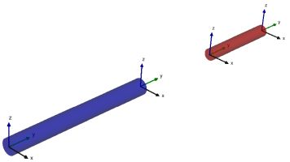
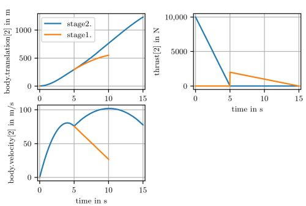

# Segmented Simulation

Variable-structure systems [^1] are equation-based systems where variables can appear and disappear during simulation.
The segmented simulation approach of Modia allows changes of the number of equations and states during events without re-generation and re-compilation of code.
Such a simulation run is partitioned into phases that are called segments or modes.
The idea of multi-mode modeling is to define model components whose equations change when a transition to another state occurs.
The number of modes is usually not known in advance.

There are two main advantages of the approach
- the user does not have to decide in advance how the system changes the equations, since this is decided at runtime
- switching to a new mode is usually very efficient, since no code needs to be regenerated and recompiled

This is particularly noticeable in the integrated multi-body component Modia3D, which enables super-fast re-arrangement of the execution scheme to a new mode and opens up new application possibilities.
e.g., the gripping processes are much more efficient and more robust than with [Collision Handling](@ref).

To start with, some features for Modia3D are introced beforehand:

## Segmented Simulation of Modia3D Models

At initialization, Modia3Ds execution scheme is build up based on the Modia3Ds model definitions.
All information about the multibody systems components (e.g., [Object3D](@ref)s, [Joints](@ref), [Solid](@ref)s, for an example see [3. Pendulum with Modia equations](@ref)) and their functionality (e.g., [Collision Handling](@ref)) is sorted and mapped to an internal data structure with super-objects (assemblies) that can be efficiently evaluated during simulation. This execution scheme includes the definition of the states of the multibody systems and of its initial values
that are deduced from the utilized [Joints](@ref). The execution scheme is executed during the simulation of the current segment,
until one of the defined actions requests a full restart for a structural change at an event instant or the simulation is terminated.
If a full restart is required, the execution scheme is restructured (basically, this means that some internal data structures are changed).

Rigidly connected Object3Ds can form an assembly by setting `assemblyRoot = true` for the freely moving [Object3D](@ref), i.e., `fixedToParent = false`.
All rigidly connected children of such an [Object3D](@ref) belong to the assembly.
Additionally, any [Object3D](@ref), whether it is part of an assembly or not, can be a locking mechanism by setting `lockable = true` in the [Object3D](@ref) constructor.
An assembly can only interact via its rigidly fixed locking mechanism.

Actions on a Modia3D model and especially on assemblies are executed according to the following code snippets:

```
function modelProgram(actions)
    <...>  # action commands
end

myModel = Model3D(
    world = Object3D(feature=Scene()),
    <...>
    modelActions  = ModelActions(world=:world, actions=modelProgram),
    currentAction = Var(hideResult=true),
    equations=:[
        currentAction = executeActions(modelActions)],)
```

A collection of action commands is defined in a Julia function (e.g., `modelProgram`.
This function is passed as `actions` argument to the Modia3D constructor `ModelActions` that returns a reference (e.g., `currentAction`) to an internal data structure. This data structure is passed to `executeActions` which is called in a Modia `equations` section.


The action commands increase or decrease the number of degrees of freedom and therefore trigger a full restart of a new segment.
If the number of degrees of freedom increases, new states are defined and their initial values are computed based on the last configuration.
Two actions (`ActionAttach, ActionReleaseAndAttach`) are only possible if the referenced lockable Object3Ds
are close together and the relative velocity and angular velocity are close to zero.
Currently, the following cases are treated:

- A freely moving assembly is rigidly connected to an [Object3D](@ref) with `ActionAttach`.
          This action reduces the number of degrees of freedom by $6$.
- If an assembly has at least two lockable Object3Ds (objA, objB) and is rigidly connected via objA,
          this rigid connection is removed and another rigid connection via objB is introduced with `ActionReleaseAndAttach`.
          This action does not affect the number of degrees of freedom, but changes the structure of the super-objects.
- A rigidly connected assembly, i.e., rigid connection to an [Object3D](@ref) is unlocked with
          `ActionRelease` to get a freely moving assembly. This action increases the number of degrees of freedom by $6$.
- An assembly that is either freely moving or is rigidly connected to an [Object3D](@ref) is deleted with
          `ActionDelete`. All Object3Ds of this assembly are removed from the Modia3D model.

Whenever one of these actions is executed, the internal data structure with its super-objects must be restructured because the relations and connections between parents and their children have changed.
As a result of this restructuring, objects may no longer be able to collide with each other or the common mass properties of super-objects may have changed.

Modia3D actions that trigger a full restart for a structural change are:

| Function  | Description |
|:---|:-------------------|
| `ActionAttach(...)`     |  Rigidly attaches the specified  assembly. |
| `ActionReleaseAndAttach(...)` | Changes one rigid connection to another rigid connection. |
| `ActionRelease(...)`    |  Releases the specified assembly. |
| `ActionDelete(...)`     |  Deletes the specified assembly. |


Other Modia3D actions that can be utilized, but do not result in a full restart, are listed in the following.

| Function  | Description |
|:---|:-------------------|
| `EventAfterPeriod(...)` |  Triggers an event after a specific period of time. |
| `ActionWait(...)`       |  Waits a specific period of time.|
| `addReferencePath(...)` |  Adds a new reference path.  |
| `ptpJointSpace(...)`    |  Generates a point-to-point trajectory|


## Application

The here discussed segmented simulation of a two stage rocket is presented in [^1] and in `"$(Modia3D.path)/test/Tutorial/TwoStageRocket3D.jl"`. The two stages are visualized as cylinders. Stage 1 is a blue cylinder and stage 2 is a red cylinder.
The locking mechanisms are visualized as little coordinate systems.





One stage is modeled with submodel `RocketStage` consisting of a cylinder with lockable Object3Ds at the top and at the bottom and a thrust at the bottom. Model `TwoStageRocket` builds up the rocket system with the `world` object,
two instances of `RocketStage` and a `ModelActions` constructor that defines the actions with function `rocketProgram`:

- Initially, the two stages are not rigidly connected. At initialization, the top of stage1 and the bottom of stage2 are attached with `ActionAttach(actions, "stage1.top", "stage2.bottom")`, see visualization (left).
- An event is triggered after 5 s with `EventAfterPeriod(actions, 5)` to release `state1.top` from `state2.bottom` with `ActionRelease(actions, "stage1.top")`. This separates the two stages, see visualization (right). Furthermore, thrust1 is switched off.
- Again an event is triggered  after 5 s with `EventAfterPeriod(actions, 5)`. Since the movement of stage1 is no longer of interest in this scenario, `state1.top` and all Object3Ds connected to it are deleted with `ActionDelete(actions, "stage1.top")`. Thus, stage1 is removed from the simulation run.


The commands above generate an instance of the model, simulate it and generate the following plot:



```
module TwoStageRocket3DModule

using Modia3D

dt1 = 5.0
dt2 = 5.0
dt3 = 5.0
t1  = dt1         # stage1 and stage2 are seperating
t2  = t1 + dt2    # stage1 is deleted
t3  = t2 + dt3    # time when thrust of stage2 is zero.
f1max = 1e4       # maximum thrust of stage1
f2max = 0.2e4     # maximum thrust of stage2


function rocketProgram(actions)
    ActionAttach(actions, "stage1.top", "stage2.bottom")
    EventAfterPeriod(actions, dt1)
    ActionRelease(actions, "stage1.top")
    EventAfterPeriod(actions, dt2)
    ActionDelete(actions, "stage1.top")
    return nothing
end


linearThrust(time, t1, f1, t2, f2) =
    # it t1 <= time <= t2, return force at time linearly interpolated
    # through (t1,f1), (t2,f2) otherwise return 0.0
    if time >= t1 && time <= t2
        (f2-f1)/(t2-t1)*(time-t1) + f1
    else
        0.0
    end

thrustStage1(; time, objectApply, objectCoord) =
    Modia.SVector{3,Float64}(0.0, linearThrust(time, 0.0, f1max, t1, 0.0), 0.0)
thrustStage2(; time, objectApply, objectCoord) =
    Modia.SVector{3,Float64}(0.0, linearThrust(time, t1, f2max, t3, 0.0), 0.0)

# L: length of rocket stage
# d: diameter of rocket stage
# m: mass of rocket stage
# color: color of cylinder
RocketStage(; L=1.0, d=0.1, m=100.0, color="blue", thrustFunction,  translation) = Model(
    # Rocket stage is a cylinder
    body = Object3D(parent=:world, fixedToParent=false, assemblyRoot=true,
                    translation=translation,  feature=Solid(
                        massProperties=MassProperties(mass=m, Ixx=1.0, Iyy=1.0, Izz=1.0),
                        shape=Cylinder(axis=2, diameter=d, length=L),
                        visualMaterial=VisualMaterial(color=color, transparency=0.5))),
    bottom = Object3D(parent=:body, translation=:[0.0, -$L/2, 0.0], lockable=true),
    top = Object3D(parent=:body, translation=:[0.0,  $L/2, 0.0], lockable=true),
    thrust = WorldForce(; objectApply=:bottom, forceFunction=thrustFunction)
)

TwoStageRocket = Model3D(
    world = Object3D(feature=Scene(enableContactDetection=false)),
    worldFrame = Object3D(parent=:world, feature=Visual(shape=CoordinateSystem(length=1.0))),
    stage1 = RocketStage(L=2.0, d=0.2 , color="blue", thrustFunction=thrustStage1,
                translation=[0,1,0]),
    stage2 = RocketStage(L=1.0, d=0.15, color="red" , thrustFunction=thrustStage2,
                translation=[0,2.5,0]),

    modelActions = ModelActions(world=:world, actions=rocketProgram),
    currentAction = Var(hideResult=true),
    equations=:[
        currentAction = executeActions(modelActions)
    ],
)

rocket = @instantiateModel(TwoStageRocket, unitless=true)

simulate!(rocket, stopTime=15.0)

@usingModiaPlot
plot(rocket, [("stage2.body.translation[2]", "stage1.body.translation[2]" ),
              ("stage2.body.velocity[2]", "stage1.body.velocity[2]"),
              ("stage1.thrust.forceVector[2]", "stage2.thrust.forceVector[2]")])
end
```


Other applications are discussed in [^1] as well.

## Literature
[^1]:
    Andrea Neumayr, Martin Otter,
      [Modelling and Simulation of Physical Systems with Dynamically Changing Degrees of Freedom](https://doi.org/10.3390/electronics12030500), Electronics 2023, 12(3), 500, [10.3390/electronics12030500](https://doi.org/10.3390/electronics12030500)
